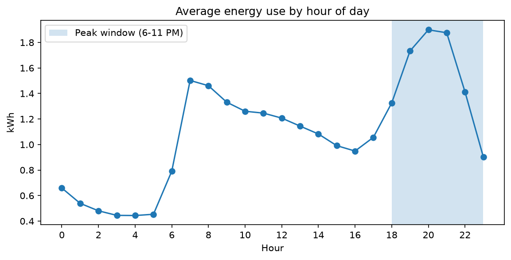
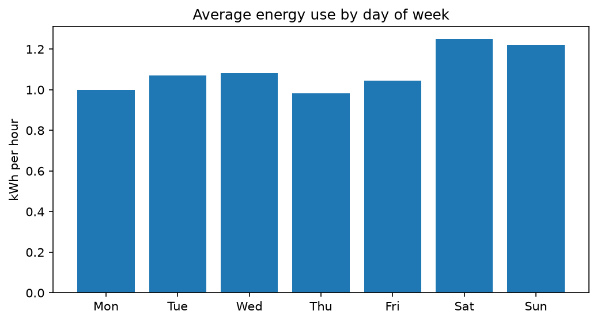
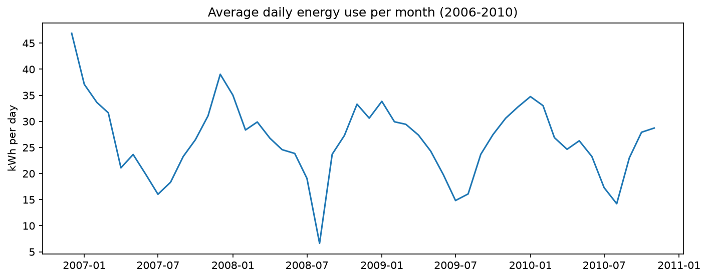
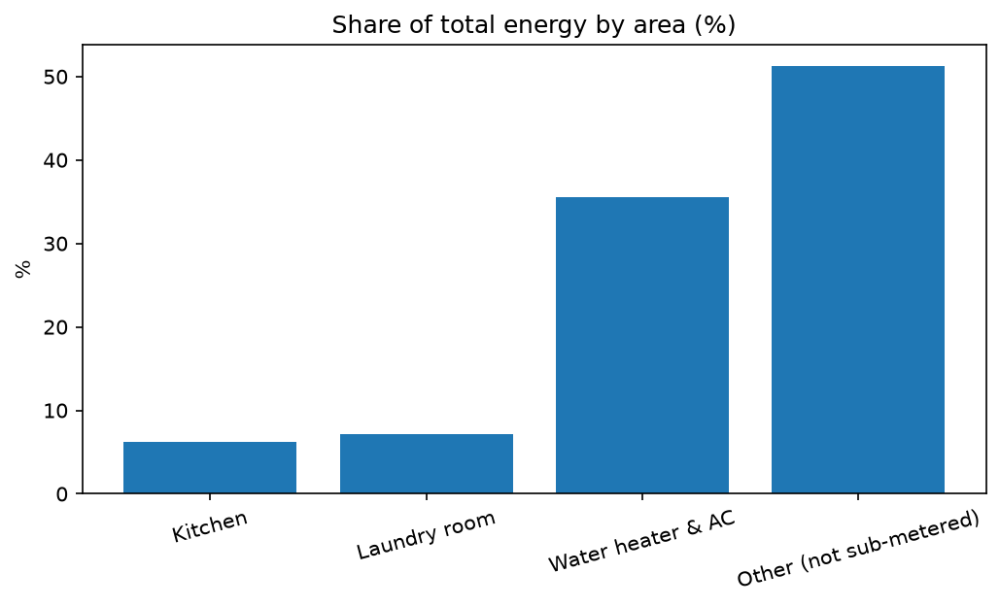
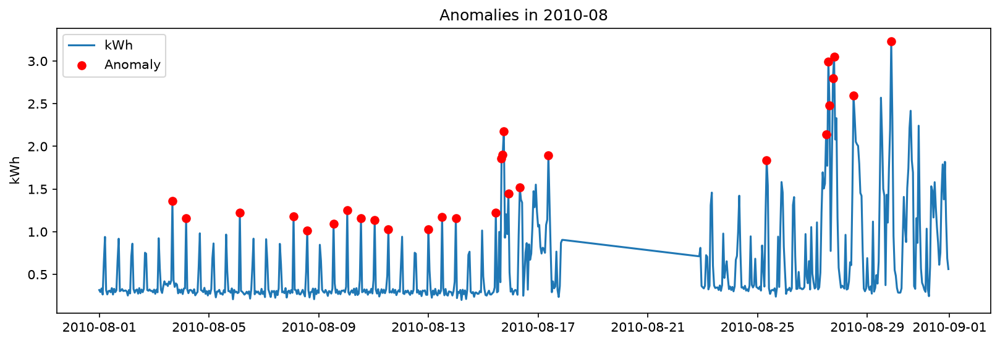

# Household Energy Consumption Analysis

Analysis of minute-level electricity usage from one household (Dec 2006 - Nov 2010) using pandas and NumPy: usage patterns, peak load, appliance breakdown and anomaly detection.

## Data
- Source: UCI Machine Learning Repository, "Individual Household Electric Power Consumption"
- Size: [rows from df.shape] minute-level readings, resampled to 34,176 hourly values
- Missing values: [1.25]% before cleaning, [1.21]% after interpolating gaps up to 60 minutes. Longer gaps were left empty.

## Method
- Parsed date and time into a datetime index
- Resampled to hourly, daily and monthly averages
- Grouped usage by hour, weekday and month
- Anomaly detection: rolling z-score on hourly usage (7-day baseline, threshold 3)
- Low-usage days: days below 40% of the previous 30-day median
- Missing-data periods: gaps in readings longer than 2 hours

## Key findings
- **Peak load:** 6-11 PM is 21% of the day but carries 31.5% of all energy. The top hours are 8, 9 and 7 PM.
- **Night:** the lowest usage is at 3-5 AM.
- **Weekends** use about 18% more than weekdays (1.23 vs 1.04 kWh per hour).
- **Seasonality:** December is highest (1.49 kWh per hour), August is lowest (0.57), about 2.6x lower.
- **Appliances:** water heater and AC account for 35.5% of energy, laundry 7.1%, kitchen 6.2%. 51.2% is not covered by any sub-meter.
- **Anomalies:** 470 of 34,176 hours (1.38%) were flagged, all spikes.
- **Low-usage days:** 43 of 1,442 days (3.0%), 13 of them in August 2008, consistent with a holiday period.
- **Missing data:** 7 gaps longer than 2 hours, the longest about 5 days ending 22 Aug 2010.

## Charts

## Limitations
- Single household, so the findings may not generalize.
- The z-score method only caught spikes. Usage can't go below zero, so drops were found separately with the low-usage rule.
- Causes (holiday, outage, heating) are interpretations and are not confirmed by the data.

## How to run
1. `pip install -r requirements.txt`
2. Download the dataset from UCI and place `household_power_consumption.txt` in `data/`
3. Run `analysis.ipynb`